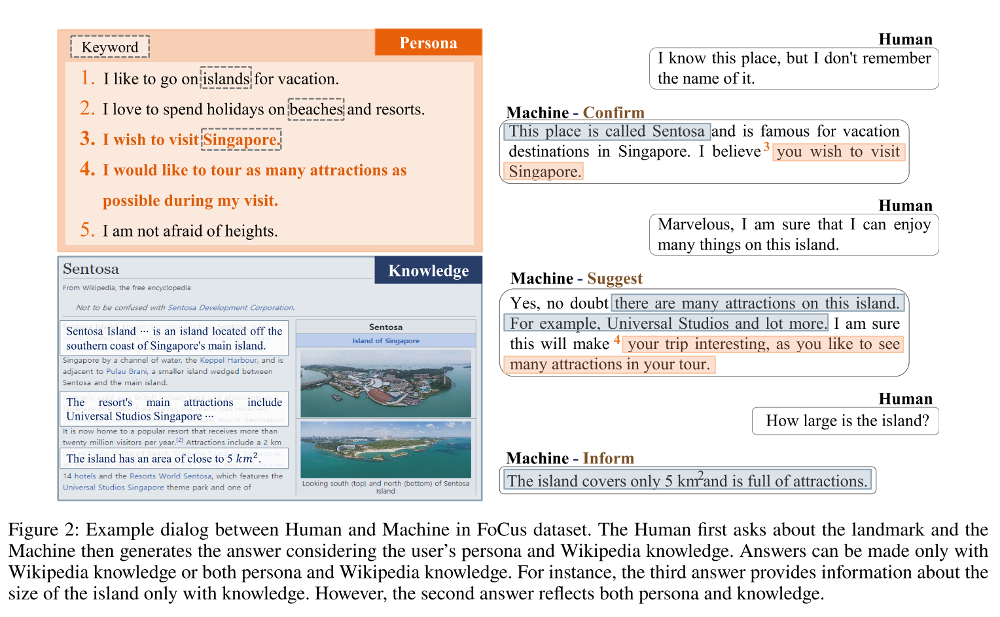

## 1. **FoCus dataset v2**]

论文：https://aaai.org/Conferences/AAAI-22/

模型代码地址：https://github.com/pkchat-focus/FoCus

下载地址：https://drive.google.com/file/d/1YmEW12HqjAjlEfZ05g8VLRux8kyUjdcI/view?usp=sharing

介绍：人类通常通过利用与他们交谈的人的主题和背景信息的先验知识来进行对话。然而，现有的会话代理和数据集并没有考虑到如此全面的信息，因此它们在生成知识和角色正确融合的话语方面存在局限性。遵循人类对话的方式，对话代理能够根据先验知识和用户的个人信息进行定制答案的对话对于满足用户至关重要。在我们的定制聊天基础角色和知识研讨会中，研究人员和学生将分享他们的前景和最新发现。

